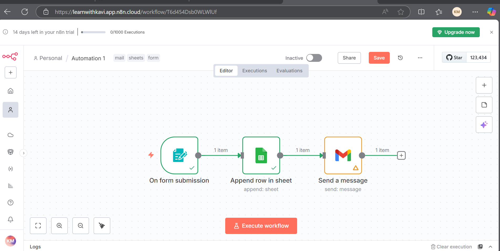

## 1. Build an automation to accept a form input, save into the sheets and send an email to the user.

- Use N8N Form to create a form.
- Drag and drop the google sheets to append the data.
- Drag and drop an email to send an email notification.

