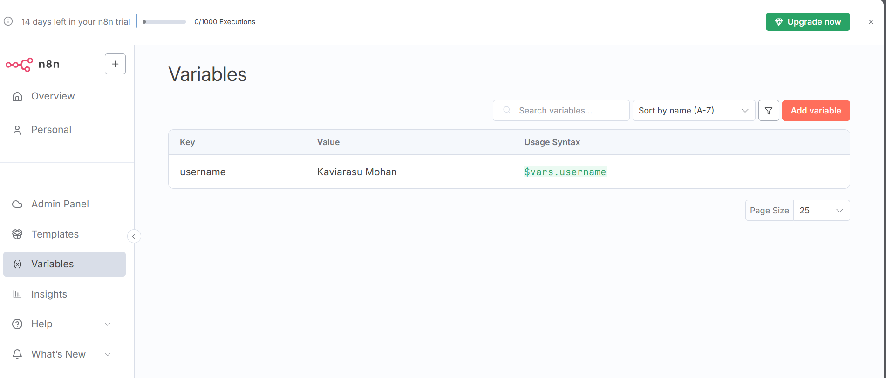

## 1.N8N

- AI Automation workflow where we can build Agents.
- Low Code/No-Code.
- Integrated with Third Party Application.
- Self Hosted.


## 2. Architecture of N8N

- Trigger the workflow.
- Perform any action.
- Output the result.

## 3. Difference between Automation and Agent.

- **Automation :** we can create an automation to check the weather in a particular city.

- **Agents :** we can create agent to check for the weather in a particular city and also with that we can suggest some new routes and we can check when the rain in going to stop with the help of AI Models.

## 4. Nodes in N8N.

- Using nodes we can perform actions in the workflow.The following nodes are,
- **Trigger Node :** There are different way to triggers the workflow.**E.g** Manual Trigger, Schedule Trigger, Form Trigger(form action), Message Based Trigger(based on some message we can trigger), Webhook Trigger(listen for http request on a particular URL), Workflow Trigger(Trigger a another workflow).
- **Action Node :** we can intergrate and perform actions on Third party application using action nodes.**E.g** Interact with sheets,Create and interact AWS services, sending an email, sending any message in slack..all the third party applications available.
- **Utility Node :** It also called as a data Transformation.There are different types of utility nodes.**E.g** If Node, Filter Node, Switch Node, Merge Node, Split Node, Aggregate Node.
- **Core Node :** we can perform some data manipulations.**E.g** Code Node(To write a code in python or Js), HTTP Request Node(send an http request).
- **Agent Node :** we can call an AI Models set an memeory to it.**E.g** AI Agent, LLM Chain, Sentimental Analyis.
- **Human in the loop :** we can have human interaction in the workflow.

## 5. Variables.

- we can create a variable and use that variable across the workflows.


## 6. Credentails.

- we can store our credentails in the credentails store and we can use it in our workflow.


## 8. Error Debug.

- If any error, there are multiple ways to handle.
- Stop workflow,
- Continue,
- Continue with error output.

## 8. N8N Input and output.

- N8N accpets input and output in the form of schema, table and json.
- Json it is a key value pair.

```
    {
        "name":"kavi",
        "age":12,
        "employee":true,
        "array":{1,2,3}
    }
```


