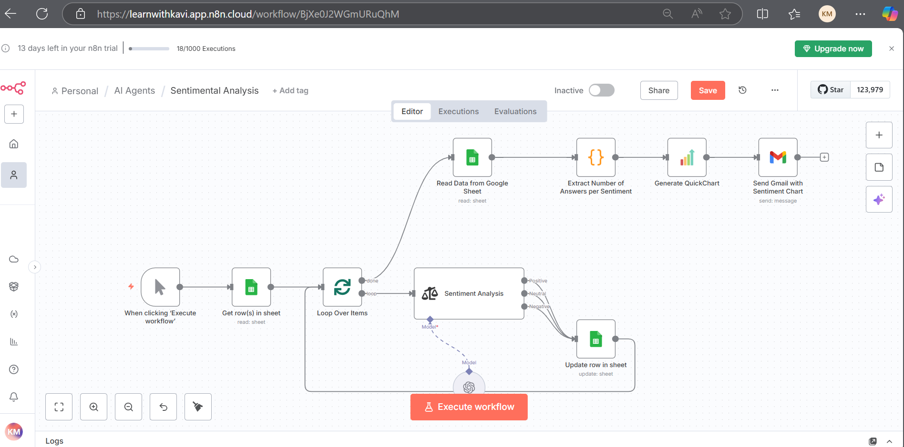

## 1. Sentimental Analysis.

- Collect the customer feedback about the product in the google sheet.
- Using sentimental Analysis check the customer review and whether the model needs to find out whether it is a positive, negative or neutral review.
- Once the model finds out append the review in the google sheets.
- And construct a simple chat based on the ratings given by the model.
- And send an mail to the Admin for the review.

