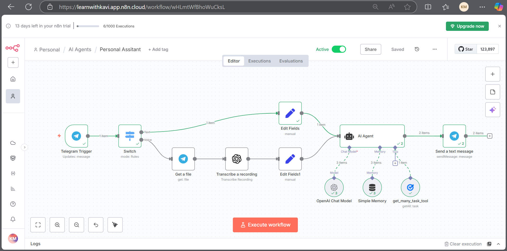
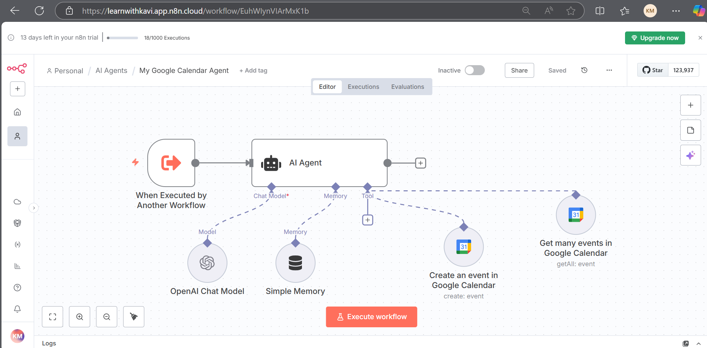
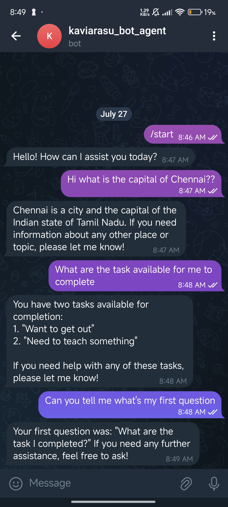
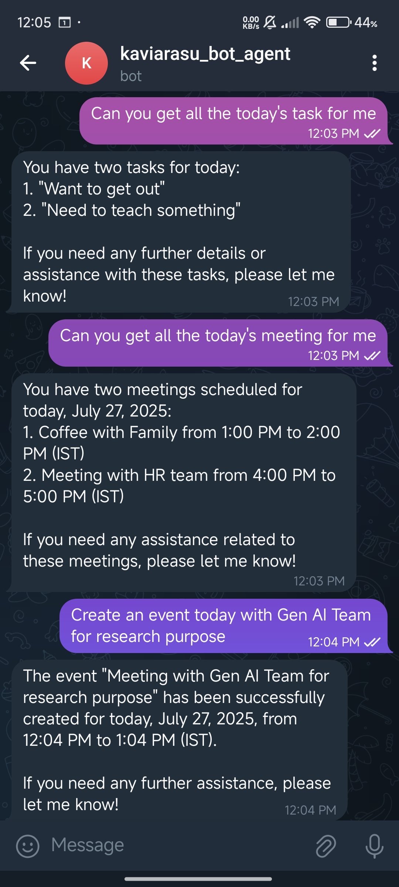

## Telegram AI Assistant with n8n

A smart, multimodal assistant built using [n8n](https://n8n.io) that integrates with **Telegram**, **Google Tasks**, **Google Calendar**, and **Google Sheets**. It accepts both **text and audio input**, responds using **OpenAI models**, and manages daily productivity through a **multi-agent system**.

- 🗣️ **Multimodal Input**: Accepts both text and voice messages via Telegram.
- 🧠 **AI-Powered Responses**: Uses OpenAI's GPT models to generate intelligent replies.
- 📅 **Daily Task Retrieval**: Fetches tasks from Google Tasks and displays them in Telegram.
- 🕒 **Calendar Integration**: Syncs with Google Calendar to provide event summaries.
- 🧩 **Multi-Agent Architecture**: Modular agents handle specific tasks like scheduling, task management, and memory.
- 📝 **Simple Memory**: Retains context across sessions for smoother conversations.
- 📊 **Google Sheets Integration**: Logs interactions and tasks for tracking and analysis.

## Output 

